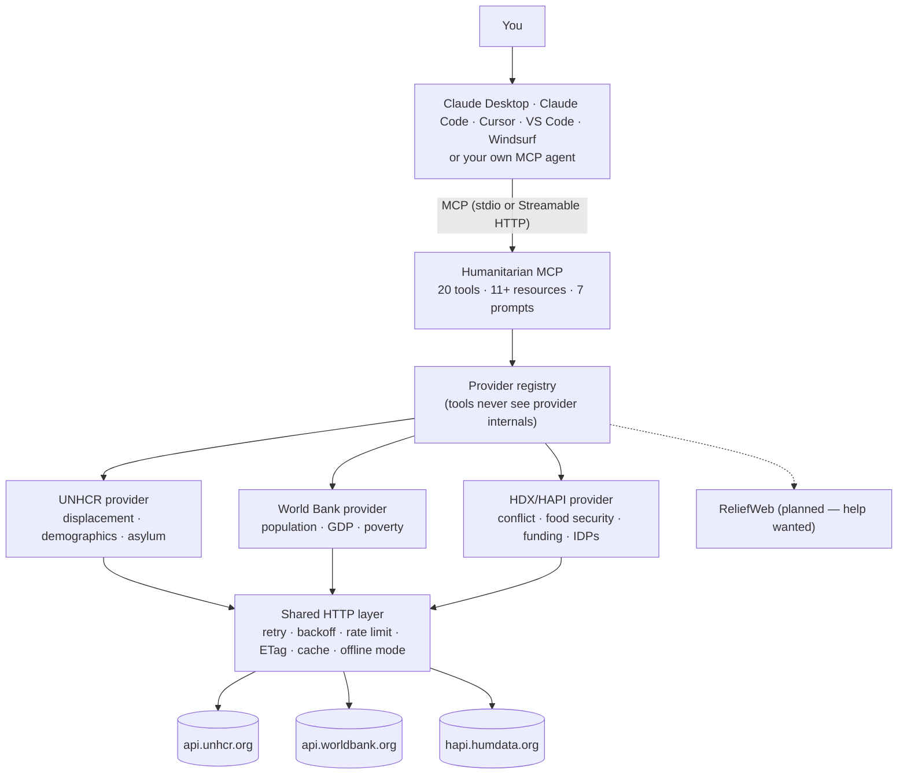

# Humanitarian MCP

**Trusted humanitarian data — refugees, conflict, hunger, funding — as one clean, citable interface for AI assistants and research code.**


[](https://github.com/ahmedvnabil/humanitarian-mcp/actions/workflows/ci.yml)
[](https://github.com/ahmedvnabil/humanitarian-mcp/releases)
[](https://github.com/ahmedvnabil/humanitarian-mcp/pkgs/container/humanitarian-mcp)
[](https://www.npmjs.com/package/humanitarian-mcp)
[-8b5cf6>)](CITATION.cff)
[](https://modelcontextprotocol.io)
[](LICENSE)

```text
"How many refugees does Jordan host right now?"
"Top refugee-hosting countries per capita — not absolute numbers."
"Relate Sudan's displacement to conflict fatalities since 2018."
"Export that as citation-ready CSV with a codebook."          ← also works in Arabic: «قارن بين مصر والأردن»
```

---

## What is Humanitarian MCP?

Humanitarian MCP is an open-source server that gives AI assistants and analysis scripts **reliable, normalized, read-only access** to trusted humanitarian datasets: 75 years of UNHCR displacement statistics, World Bank context indicators, and HDX crisis data (conflict events, food security, humanitarian funding, internal displacement).

**MCP in one paragraph:** the [Model Context Protocol](https://modelcontextprotocol.io) is an open standard — think "USB for AI tools" — that lets any AI application (Claude Desktop, Claude Code, Cursor, VS Code, Windsurf, custom agents) plug into external systems through one protocol. A server like this one exposes _tools_ the model can call, _resources_ it can read, and _prompts_ it can reuse. Connect it once, and every question your assistant answers about displacement is grounded in the real numbers instead of its training data. New to MCP? Read [docs/how-mcp-works.md](docs/how-mcp-works.md).

Humanitarian data is public but hostile to programmatic use — different country-code schemes, different schemas, silent failure modes (details below). This project normalizes multiple humanitarian datasets into **one consistent record shape, one country-code scheme (ISO3), one interface**, with the citation attached to every payload.

## Why this project exists

Every trap below is real, encoded in this codebase, and covered by tests:

| Problem                         | Example                                                                                                                                                                                                      | What this server does                                                                                               |
| ------------------------------- | ------------------------------------------------------------------------------------------------------------------------------------------------------------------------------------------------------------ | ------------------------------------------------------------------------------------------------------------------- |
| **Country-code chaos**          | UNHCR's internal codes disagree with ISO3 for **99 of 232 countries**. Egypt is `ARE` in UNHCR-speak — which is the UAE's ISO code. Ask a raw API "refugees in ARE?" and you silently get the wrong country. | Everything speaks ISO3. Names resolve fuzzily in English **and Arabic** («مصر», «الأردن», «السودان»).               |
| **Schema babel**                | UNHCR returns `{items: [...]}`, the World Bank returns `[meta, rows]`, HAPI returns `{data: [...]}` — each with different field names, pagination and update cadence.                                        | One `NormalizedRecord` shape across all sources: `country_code, year, population, metrics, source, dataset`.        |
| **Dirty cells**                 | Numeric values arrive as numbers, numeric _strings_, or `"-"`.                                                                                                                                               | Cleaned once, at the provider layer. Missing stays missing — never silently zero.                                   |
| **Silent empties**              | Most query mistakes return an empty list, not an error. An AI confidently reports "no data".                                                                                                                 | Errors come back as actionable text: _"No country matched 'Atlantis'. Try search_country first."_                   |
| **Aggregation traps**           | IDP assessment rounds must **not** be summed (double-counts people); funding coverage must be recomputed, never averaged; IPC projections must not be mixed with current analyses.                           | Each dataset's aggregation semantics are encoded and unit-tested.                                                   |
| **Misleading absolute numbers** | Lebanon and Germany host similar refugee counts. Per 1,000 residents, they are worlds apart.                                                                                                                 | `normalize_by: "population" \| "gdp"` — denominators matched **per year**, denominator year disclosed on every row. |
| **Missing citations**           | Models paraphrase numbers with no provenance.                                                                                                                                                                | Every payload carries its source; exports attach a reproducible extraction manifest and optional codebook.          |

Without a trusted middleware, an LLM pointed at raw humanitarian APIs re-discovers these traps every session — and the failure mode is not a crash, it is a **plausible-looking wrong number**. This server exists so that never happens.

## Architecture



Three invariants hold everywhere: **(1)** nothing provider-specific leaks outside `src/providers/<id>/`; **(2)** every tool is read-only and annotated as such; **(3)** errors reach the model as actionable text, never stack traces. Deep dive: [docs/architecture.md](docs/architecture.md).

## Two ways to use it

> **TL;DR** — researchers and organizations who care about control: self-host. Everyone who just wants answers: use the hosted endpoint.

|                     | 🖥️ **Self-hosted**                                                      | ☁️ **Hosted endpoint**                                                                    |
| ------------------- | ----------------------------------------------------------------------- | ----------------------------------------------------------------------------------------- |
| Setup               | Install Node/Docker, run the server                                     | **None** — paste one URL                                                                  |
| Who runs it         | You, on your machine or infra                                           | Maintainer-operated at `humanitarian-mcp.zad.tools`                                       |
| Privacy             | Queries never leave your machine (except to the public data APIs)       | Queries pass through the hosted server                                                    |
| Offline / fieldwork | ✅ full offline mode with a warmed cache                                | ❌ needs internet                                                                         |
| Configuration       | Every knob: providers, cache, rate limits                               | Fixed server-side                                                                         |
| Updates             | You pull releases                                                       | Updated for you (caching, normalization, rate limiting, source fixes, monitoring handled) |
| Version             | Always the latest release                                               | Rolling; may briefly lag the newest release — check `/api/status`                         |
| Guarantees          | Yours to make                                                           | Best-effort community service, no SLA today                                               |
| Cost                | Free (MIT)                                                              | Free today; free and paid plans **may** be introduced later                               |
| Best for            | Researchers, NGOs with data policies, enterprises, air-gapped fieldwork | Quick starts, demos, journalists, students                                                |

### Mode 1 — Self-hosted

You install and run the server yourself. You own everything: the process, the cache, the configuration. Your MCP client talks to it over stdio (desktop) or HTTP (remote/containers). Full instructions in [Installation](#installation) below.

```jsonc
// Claude Desktop — claude_desktop_config.json
{
  "mcpServers": {
    "humanitarian": {
      "command": "node",
      "args": ["/absolute/path/to/humanitarian-mcp/dist/index.js"],
    },
  },
}
```

### Mode 2 — Hosted endpoint

No infrastructure. Connect any Streamable-HTTP-capable MCP client to:

```
https://humanitarian-mcp.zad.tools/mcp
```

- **claude.ai / Claude Desktop (remote connector):** add a custom connector with that URL.
- **Claude Code:** `claude mcp add --transport http humanitarian https://humanitarian-mcp.zad.tools/mcp`
- **Anything that speaks HTTP:** see [examples/http-client.md](examples/http-client.md) — the endpoint is stateless JSON-RPC, no session juggling.

No API key is required today. The service is operated on a best-effort basis by the maintainer; free and paid tiers may be introduced in the future — nothing beyond what you see here is promised. If you need guarantees, self-host: it is the same code.

## Features

**Data access**

- 20 semantic, read-only tools — [full reference](docs/tools.md): country profiles, comparisons, yearly series, demographics, asylum applications/decisions with recognition rates, conflict events, food security (IPC), humanitarian funding, rankings, trend analysis with anomaly detection, (loudly caveated) naive forecasts
- 11+ MCP resources (`country://EGY`, `report://SDN`, `chart://UGA`, `metadata://providers`…) with URI autocompletion
- 7 built-in prompts (situation summary, donor briefing, anomaly hunt…)

**Country intelligence**

- Fuzzy name resolution in **English and Arabic** — «مصر», "egypt", `EGY`, "DRC", "ivory coast" all land correctly; Arabic matching folds hamza/alef forms, taa marbuta and the definite article («الأردن» = «الاردن» = «اردن»)
- The UNHCR↔ISO3 code mismatch (99/232 countries) handled invisibly

**Analytics**

- `normalize_by`: per-capita (per 1,000 residents) and per-GDP (per US$1bn) comparisons, rankings and charts, with per-year denominator matching
- Regression, year-over-year, CAGR, z-score anomaly detection
- Charts as Chart.js / Vega-Lite / Mermaid / SVG; maps as GeoJSON

**Research reproducibility**

- Extraction manifest on every export: exact arguments, timestamp, server version, citation — a repeatable recipe for a paper's appendix
- Optional variable-level codebook matching exactly the exported columns
- CSV / JSON / Markdown / GeoJSON export; CSV manifests ride in `#` comment lines (`pd.read_csv(..., comment="#")`)
- Runnable [Python & R notebooks](examples/notebooks/) reproducing four research workflows
- [CITATION.cff](CITATION.cff) + JOSS paper draft in [paper/](paper/)

**Operations**

- Two transports: stdio (desktop) and stateless Streamable HTTP (remote) + a built-in dashboard with a query playground
- Serious caching: memory or SQLite (zero native deps), TTL + ETag revalidation, stale-while-revalidate, **full offline mode** for fieldwork
- Polite by design: token-bucket rate limiting, retries with backoff, identified User-Agent, strictly read-only
- Docker image + compose for organizational self-hosting

## Live data sources

| Provider                               | Datasets                                                        | What it contributes                                                                                                                                                                                    | Key                                                |
| -------------------------------------- | --------------------------------------------------------------- | ------------------------------------------------------------------------------------------------------------------------------------------------------------------------------------------------------ | -------------------------------------------------- |
| **UNHCR Refugee Statistics** (default) | population, demographics, asylum-applications, asylum-decisions | The displacement backbone: refugees, asylum-seekers, IDPs, stateless and others of concern, 1951–present, by origin and asylum country; age/sex breakdowns; asylum decisions with recognition rates    | none                                               |
| **World Bank Indicators** (default)    | context-indicators                                              | The denominators: national population, GDP, GDP per capita, extreme-poverty rates — what turns "how many" into "how heavy a burden"                                                                    | none                                               |
| **HDX HAPI** (opt-in)                  | conflict-events, food-security, humanitarian-funding, idps      | The crisis context, citing original producers: conflict events & fatalities (**ACLED**), IPC food-insecurity phases (**IPC**), appeal requirements vs funding (**OCHA FTS**), IDP stocks (**IOM DTM**) | free app identifier ([.env.example](.env.example)) |

Planned, contributions welcome: **ReliefWeb** (situation reports, disasters, jobs) — scaffold with implementation notes in `src/providers/reliefweb/`.

## Example questions

Real prompts, real production numbers (extracted 2026-07-10 — figures are revised upstream over time):

- _"What are the top refugee-hosting countries **per capita**?"_ → Lebanon 130.7 per 1,000 residents, Chad 63.0, Moldova 56.6, Jordan 55.7 — a very different list than the absolute ranking.
- _"Was there anything unusual in Sudan's displacement data?"_ → 2023 flagged as an anomaly (z ≈ +2.6, +78.8% YoY), coinciding with the April 2023 war.
- _"Relate Sudan's conflict to its displacement since 2022."_ → conflict fatalities 2,770 → 21,020 → 22,987 (2022–2024, ACLED) alongside IDPs 3.78M → 9.05M → 11.56M (IOM DTM).
- _"How well is Sudan's humanitarian response funded?"_ → 58.5% of requirements in 2023, 76.4% in 2024 (OCHA FTS).
- _"«قارن بين عدد اللاجئين في مصر والأردن»"_ → works — country resolution is bilingual.
- _"Export Jordan's series as citation-ready CSV with a codebook."_ → `export_data({..., include_codebook: true})`.

More worked conversations with tool traces: [examples/conversations.md](examples/conversations.md).

## Why researchers like it

- **Citable**: GitHub's _Cite this repository_ button ([CITATION.cff](CITATION.cff)); a JOSS paper is drafted in [paper/](paper/).
- **Reproducible**: every export carries a manifest (exact call, timestamp, server version, source citation) — paste it in your appendix and anyone can re-run the extraction.
- **Documented data**: `include_codebook: true` generates variable-level documentation (meaning, unit, derivation — including how recognition rates and funding coverage are computed) for exactly the columns you exported.
- **Join-ready**: every row carries ISO3, so merges against World Bank / V-Dem / UCDP panels need no country-name crosswalk.
- **Honest methods**: end-year stock semantics, denominator years, truncation and forecast naivety are stated in the output, not hidden.
- **Fieldwork-ready**: warm the SQLite cache once, then `HMCP_OFFLINE=1` gives the full toolset with zero connectivity.

Start here: [docs/for-researchers.md](docs/for-researchers.md) · [notebooks](examples/notebooks/).

## Installation

Requires **Node.js ≥ 20** for source installs (SQLite cache uses built-in `node:sqlite` on Node ≥ 22.5; older Nodes fall back to memory automatically). Docker route needs only Docker.

### From npm — no clone needed

```bash
npx humanitarian-mcp --version   # → humanitarian-mcp 0.5.1
```

Register it with Claude Code in one line:

```bash
claude mcp add humanitarian -- npx -y humanitarian-mcp
```

### Claude Desktop — one click (no terminal)

Download **`humanitarian-mcp.mcpb`** from the [latest release](https://github.com/ahmedvnabil/humanitarian-mcp/releases/latest) and double-click it. Done.

### From source

```bash
git clone https://github.com/ahmedvnabil/humanitarian-mcp
cd humanitarian-mcp
npm install
npm run build
node dist/index.js --version   # → humanitarian-mcp 0.5.1
```

### Docker

```bash
docker run -p 8642:8642 -v hmcp-cache:/data ghcr.io/ahmedvnabil/humanitarian-mcp
# → MCP endpoint at http://localhost:8642/mcp + dashboard at http://localhost:8642
```

Or `docker compose up -d` with the provided [compose.yaml](compose.yaml).

### Connect your client (self-hosted, stdio)

<details><summary><strong>Claude Desktop</strong> — <code>claude_desktop_config.json</code></summary>

```json
{
  "mcpServers": {
    "humanitarian": {
      "command": "node",
      "args": ["/absolute/path/to/humanitarian-mcp/dist/index.js"]
    }
  }
}
```

Sample with cache tuning: [examples/claude-desktop-config.json](examples/claude-desktop-config.json).

</details>

<details><summary><strong>Claude Code</strong></summary>

```bash
claude mcp add humanitarian -- node /absolute/path/to/humanitarian-mcp/dist/index.js
```

</details>

<details><summary><strong>Cursor</strong> — <code>.cursor/mcp.json</code> (project) or <code>~/.cursor/mcp.json</code> (global)</summary>

```json
{
  "mcpServers": {
    "humanitarian": {
      "command": "node",
      "args": ["/absolute/path/to/humanitarian-mcp/dist/index.js"]
    }
  }
}
```

</details>

<details><summary><strong>VS Code</strong> — <code>.vscode/mcp.json</code></summary>

```json
{
  "servers": {
    "humanitarian": {
      "type": "stdio",
      "command": "node",
      "args": ["/absolute/path/to/humanitarian-mcp/dist/index.js"]
    }
  }
}
```

</details>

<details><summary><strong>Windsurf</strong> — <code>~/.codeium/windsurf/mcp_config.json</code></summary>

```json
{
  "mcpServers": {
    "humanitarian": {
      "command": "node",
      "args": ["/absolute/path/to/humanitarian-mcp/dist/index.js"]
    }
  }
}
```

</details>

Then ask: _"What are the top refugee-hosting countries this year?"_

### Enable the HDX crisis datasets (optional)

```bash
# one-time: generate a free identifier (base64 of app-name:email — not a secret)
curl 'https://hapi.humdata.org/api/v2/encode_app_identifier?application=<your-app>&email=<your-email>'

HMCP_PROVIDERS=unhcr,worldbank,hdx HMCP_HDX_APP_ID=<identifier> node dist/index.js
```

All configuration knobs: [.env.example](.env.example).

### Verify without any client

```bash
npm run dashboard   # → http://localhost:8642 — providers, health, live logs, query playground
npm run inspect     # → official MCP Inspector
```

## Repository tour

| Path                                                        | What lives there                                                                                                                                                                                                                                                                                                                                                   |
| ----------------------------------------------------------- | ------------------------------------------------------------------------------------------------------------------------------------------------------------------------------------------------------------------------------------------------------------------------------------------------------------------------------------------------------------------ |
| [`src/`](src/)                                              | The server. `providers/` (one directory per data source — the only place provider quirks may exist), `tools/`, `resources/`, `prompts/`, `shared/` (HTTP, cache, rate limiting, stats, country matching), `viz/`, `http/` (Streamable HTTP + dashboard)                                                                                                            |
| [`docs/`](docs/)                                            | [tools.md](docs/tools.md) (tool reference) · [architecture.md](docs/architecture.md) · [for-researchers.md](docs/for-researchers.md) · [how-mcp-works.md](docs/how-mcp-works.md) (MCP primer) · [adding-providers.md](docs/adding-providers.md) · [development.md](docs/development.md) · `index.html` (Arabic landing page, served at humanitarian-mcp.zad.tools) |
| [`examples/`](examples/)                                    | Client configs, worked conversations with tool traces, HTTP client recipes, runnable [Python/R notebooks](examples/notebooks/)                                                                                                                                                                                                                                     |
| [`tests/`](tests/)                                          | 125 tests: MCP compliance suite (official SDK client ↔ real server), fixture-based provider suites (no network), unit tests                                                                                                                                                                                                                                        |
| [`paper/`](paper/)                                          | JOSS paper draft (`paper.md` + `paper.bib`)                                                                                                                                                                                                                                                                                                                        |
| [`marketing/`](marketing/)                                  | Launch kit: platform-native announcement drafts                                                                                                                                                                                                                                                                                                                    |
| [`Dockerfile`](Dockerfile) / [`compose.yaml`](compose.yaml) | Organizational self-hosting (image published to GHCR on every release)                                                                                                                                                                                                                                                                                             |
| [`.github/`](.github/)                                      | CI (Node 20/22/24), release automation (npm + `.mcpb` + Docker on tag), issue templates incl. a provider-request template                                                                                                                                                                                                                                          |

## Development

```bash
npm run dev            # stdio server via tsx
npm run dev:http       # HTTP + dashboard on :8642
npm test               # vitest — unit + integration + MCP compliance
npm run check          # typecheck + lint + format + tests (run before pushing)
npm run build          # emit dist/
```

Releases: bump the version, tag `v*`, push — CI publishes the GitHub release with the `.mcpb` bundle, the Docker image to GHCR, and (once the npm token is configured) the npm package. Full guide: [docs/development.md](docs/development.md) · adding a data source: [docs/adding-providers.md](docs/adding-providers.md).

## Roadmap

**✅ Completed**

- v0.1.0 — UNHCR provider, 17 tools, resources, prompts, caching/offline, dashboard, compliance suite
- v0.2.0 — release automation (npm workflow + `.mcpb`), CITATION.cff, **Arabic country names**, reproducible extraction manifests
- v0.3.0 — **World Bank provider** + `normalize_by` per-capita / per-GDP analytics
- v0.4.0 — **HDX/HAPI provider** (conflict, food security, funding, IDPs) + 3 crisis tools + **Docker/GHCR**
- v0.5.0 — codebooks, Python/R notebooks, JOSS paper draft
- v0.5.1 — HDX fixes from the first live verification round (per-theme admin levels, server-side year windows, pagination)
- **Published to npm** — `npx humanitarian-mcp` is live

**🚧 In progress**

- Zenodo DOI per release
- JOSS paper review & submission
- npm provenance signing on future releases (via the release workflow once its token is configured)

**🔭 Future (contributions welcome)**

- ReliefWeb provider (situation reports, disasters, jobs) — scaffold ready
- Full Arabic report generation (`locale: "ar"`)
- UNHCR Operational Data Portal situations
- Sturdier statistics (confidence intervals, changepoint detection)
- Redis cache backend

## FAQ

<details><summary><strong>What is MCP and do I need to understand it?</strong></summary>

No. MCP (Model Context Protocol) is the plumbing standard that connects AI apps to tools. You paste a config or double-click the `.mcpb` file; your assistant does the rest. Curious anyway? [docs/how-mcp-works.md](docs/how-mcp-works.md).
</details>

<details><summary><strong>Do I need an API key?</strong></summary>

No — UNHCR and World Bank need none. Only the optional HDX datasets need a free "app identifier" (base64 of your app name + email, generated in one curl; not a secret).
</details>

<details><summary><strong>Is this an official UNHCR / UN product?</strong></summary>

No. It is an independent open-source project. All data is © its original producers (UNHCR, World Bank, ACLED, IPC, OCHA, IOM via HDX), and every payload carries that attribution.
</details>

<details><summary><strong>Why not just let the AI call the UN APIs directly?</strong></summary>

Because the failure mode is silent wrong answers: UNHCR's `ARE` is Egypt, but ISO's `ARE` is the UAE; empty results look like "no data"; `"-"` cells break math. This server encodes those traps once, with 125 tests. See [Why this project exists](#why-this-project-exists).
</details>

<details><summary><strong>Is the data real-time?</strong></summary>

It is as fresh as the sources: UNHCR publishes end-year (and mid-year) statistics, the World Bank annual indicators, HDX themes on their producers' cadence. The server caches responses (default 1 h fresh, stale-while-revalidate after) — it never makes data older than the source.
</details>

<details><summary><strong>Why do the numbers differ from what I saw in the news?</strong></summary>

Usually one of: news quotes flows ("X arrived this month") while these are stocks ("X present at year-end"); different population categories (refugees vs all people of concern); or upstream revisions — UNHCR revises series retroactively. Record your extraction date (the manifest does it for you).
</details>

<details><summary><strong>Refugees vs IDPs vs asylum-seekers — which numbers am I getting?</strong></summary>

Each category is a separate metric (`refugees`, `idps`, `asylum_seekers`, `stateless`…), and the codebook defines every one. The `population` headline per dataset is documented in [docs/tools.md](docs/tools.md) and in generated codebooks.
</details>

<details><summary><strong>What does <code>role: "asylum"</code> vs <code>role: "origin"</code> mean?</strong></summary>

`asylum` = people hosted **in** the country (default); `origin` = people displaced **from** it. Mixing them up is the most common analysis error — the server's instructions teach connected models this convention up front.
</details>

<details><summary><strong>How does per-capita ranking work?</strong></summary>

`normalize_by: "population"` divides by the country's population **of the same year** (World Bank), scales per 1,000 residents, re-sorts the ranking, and discloses the denominator year on every row. `"gdp"` does the same per US$1bn. Countries lacking denominator data are counted, never silently dropped.
</details>

<details><summary><strong>Does Arabic really work?</strong></summary>

Yes — country resolution covers official UN Arabic names for 100% of countries served, plus common variants, with spelling-variant folding («الأردن» = «الاردن» = «اردن»). Tool _output_ is currently English; full Arabic report generation is on the roadmap.
</details>

<details><summary><strong>Can I use it without any AI at all?</strong></summary>

Yes. `npm run dashboard` gives you a query playground and a plain HTTP bridge (`POST /api/call`) — the [Python/R notebooks](examples/notebooks/) use exactly that. The `/mcp` endpoint is also plain JSON-RPC ([examples/http-client.md](examples/http-client.md)).
</details>

<details><summary><strong>Self-hosted vs hosted — which should I pick?</strong></summary>

Self-host if you need control, privacy guarantees, offline mode, or custom configuration (it's the same MIT-licensed code). Use the hosted endpoint to be running in 30 seconds. Full comparison: [Two ways to use it](#two-ways-to-use-it).
</details>

<details><summary><strong>What does the hosted endpoint log about me?</strong></summary>

The hosted instance runs this open-source code, which keeps in-memory usage counters (per-tool call counts/latency for its dashboard) and standard server logs. It has no accounts, no API keys, and stores no personal data by design. If that is still too much, self-host.
</details>

<details><summary><strong>Does it work offline / in the field?</strong></summary>

Yes (self-hosted): run once online with `HMCP_CACHE=sqlite` to warm the cache, then `HMCP_OFFLINE=1` serves everything from cache and fails loudly on misses.
</details>

<details><summary><strong>Which AI clients are supported?</strong></summary>

Anything that speaks MCP: Claude Desktop & claude.ai, Claude Code, Cursor, VS Code, Windsurf, and custom agents via the official SDKs (stdio or Streamable HTTP). Config snippets are in [Installation](#installation).
</details>

<details><summary><strong>Windows / macOS / Linux?</strong></summary>

All three — plain Node with zero native dependencies (the SQLite cache uses Node's built-in `node:sqlite`). The Docker image covers anything that runs containers.
</details>

<details><summary><strong>How heavy is it?</strong></summary>

Two runtime dependencies (the MCP SDK and zod), no database server required, and the Docker image is a slim multi-stage Node build. It runs comfortably on the smallest VPS tier.
</details>

<details><summary><strong>Are the forecasts reliable?</strong></summary>

They are deliberately naive (OLS extrapolation) and say so in their own output. Use them as a baseline sanity check, never as planning figures — UNHCR publishes no such projections through this API.
</details>

<details><summary><strong>Can rate limits at the sources break my session?</strong></summary>

The server rate-limits itself (token bucket, default 4 req/s per provider), retries with backoff, and serves stale cache when a source is down — your session degrades gracefully instead of erroring.
</details>

<details><summary><strong>How do I cite it in a paper?</strong></summary>

See [Citation](#citation) below — BibTeX/APA/Chicago provided, plus GitHub's "Cite this repository" button. Cite the _data_ as its original producers (the manifests include the right citation string per dataset).
</details>

<details><summary><strong>How do I add a new data source?</strong></summary>

One directory, one interface, fixture-based tests — the full worked guide is [docs/adding-providers.md](docs/adding-providers.md), and there's a provider-request issue template. ReliefWeb is the most-wanted next provider.
</details>

<details><summary><strong>Can my NGO run this internally?</strong></summary>

Yes — that's what the Docker image and compose file are for. MIT license, commercial use fine. Keep the HTTP endpoint behind your reverse proxy/VPN (it is unauthenticated by design — see [SECURITY.md](SECURITY.md)).
</details>

<details><summary><strong>Is any of this data about identifiable individuals?</strong></summary>

No. Everything is aggregate national statistics from public sources. Still: these numbers represent people — present them with the care they deserve (see [Data & responsibility](#data-attribution--responsibility)).
</details>

## Contributing

Contributions welcome — most wanted: the **ReliefWeb provider**, country-alias corrections, and documentation in more languages. Start with [CONTRIBUTING.md](CONTRIBUTING.md); the golden rules: read-only always, provider isolation, no network in tests, attribution is not optional.

## Citation

Software (also available via GitHub's **"Cite this repository"** button — [CITATION.cff](CITATION.cff); a Zenodo DOI per release is being set up):

**BibTeX**

```bibtex
@software{nabil_humanitarian_mcp_2026,
  author  = {Nabil, Ahmed},
  title   = {humanitarian-mcp: a Model Context Protocol server for humanitarian open data},
  year    = {2026},
  version = {0.5.1},
  url     = {https://github.com/ahmedvnabil/humanitarian-mcp},
  license = {MIT}
}
```

**APA** — Nabil, A. (2026). _humanitarian-mcp: A Model Context Protocol server for humanitarian open data_ (Version 0.5.1) [Computer software]. https://github.com/ahmedvnabil/humanitarian-mcp

**Chicago** — Nabil, Ahmed. _humanitarian-mcp: A Model Context Protocol Server for Humanitarian Open Data_. V. 0.5.1. Computer software, 2026. https://github.com/ahmedvnabil/humanitarian-mcp.

Cite the **data** as its producers: UNHCR Refugee Data Finder; World Bank World Development Indicators (CC BY 4.0); ACLED / IPC / OCHA FTS / IOM DTM via HDX HAPI — every export's manifest carries the exact citation string for its dataset. Method notes: [docs/for-researchers.md](docs/for-researchers.md).

## Data, attribution & responsibility

- Data © its original producers: **UNHCR** ([Refugee Data Finder](https://www.unhcr.org/refugee-statistics/)), **World Bank** (CC BY 4.0), and via **HDX HAPI**: ACLED, IPC, OCHA FTS, IOM DTM. This project is unofficial and unaffiliated.
- The server is strictly **read-only** and respects upstream rate limits.
- Figures are end-year stocks; recent years may be preliminary; series get revised — record extraction dates (manifests do).
- Forecasts are naive extrapolations, clearly labelled.
- These numbers represent people. Present them with the care they deserve.

## License

[MIT](LICENSE) — free for research, NGO, commercial and government use.
