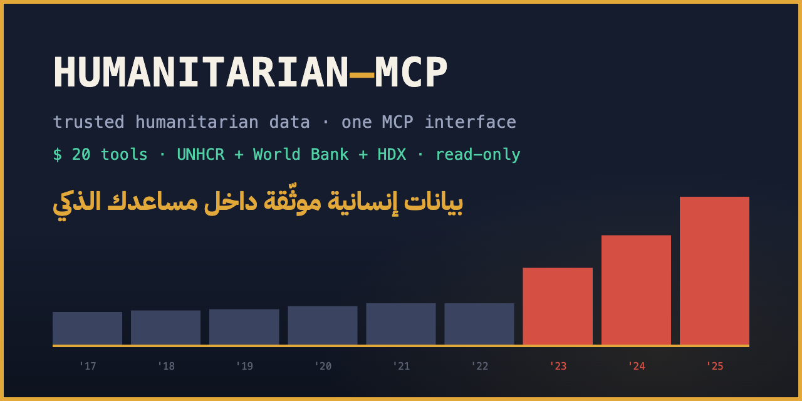
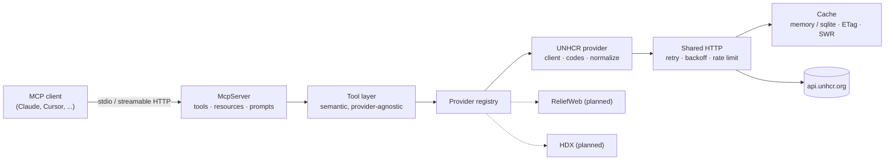

# Humanitarian MCP



[](https://github.com/ahmedvnabil/humanitarian-mcp/actions/workflows/ci.yml)
[](LICENSE)
[](package.json)
[](https://modelcontextprotocol.io)

**A Model Context Protocol server for humanitarian open data.**

Give any MCP client — Claude Desktop, Claude Code, Cursor, or your own agent — clean, semantic access to trusted humanitarian datasets. No REST plumbing, no country-code trivia, no pagination loops: the assistant calls `compare_countries("Egypt", "Jordan")` and gets analysis-ready data with citations.

```
"Compare refugee populations in Egypt and Jordan over the last five years."
"Generate a humanitarian report about Sudan."
"Chart the trend of Syrian displacement as a Mermaid diagram."
"Export the top host countries as GeoJSON."
```

Today it speaks to the **UNHCR Refugee Statistics API** (75 years of displacement data, no API key needed) and the **World Bank Indicators API** (population, GDP, poverty — the denominators behind `normalize_by`, so "refugees per 1,000 residents" is one argument away). The provider architecture is built for more: HDX/HAPI, ReliefWeb, IOM, UNICEF and WHO each slot in as a self-contained module.

---

## Why this exists

Humanitarian data is public but hostile to automation-by-LLM:

- UNHCR uses **its own country codes** that disagree with ISO3 for 99 of 232 countries (Egypt is `ARE` in UNHCR-speak, `EGY` in ISO — and `ARE` is the UAE's ISO code!).
- Numeric cells arrive as numbers, numeric **strings**, or `"-"`.
- Getting "top host countries" requires knowing the `coa_all=true` incantation.
- Every mistake produces a silently empty result, not an error.

An LLM pointed at the raw REST API burns tokens rediscovering these traps every session. This server encodes them once, behind tools with humane names, and returns normalized records with consistent fields: `country`, `country_code`, `year`, `population`, `metrics`, `source`, `last_updated`, `dataset`.

## Features

- **17 semantic tools** — search, profiles, comparisons, demographics, asylum statistics, rankings, trend analysis with anomaly detection, naive forecasting, full markdown reports, chart generation (Chart.js / Vega-Lite / Mermaid / SVG), GeoJSON maps, CSV/JSON/Markdown export, provider metadata and health.
- **11+ resources** — `country://EGY`, `report://SDN`, `chart://UGA`, `dataset://population`, `metadata://providers` and more, with URI-template completion.
- **7 built-in prompts** — situation summaries, country comparison, donor briefing, trend explanation, anomaly hunt, executive report, infographic content.
- **Structured outputs** — every tool declares an output schema and returns `structuredContent` alongside readable markdown.
- **Progress streaming** — long operations (report generation) emit MCP progress notifications.
- **Two transports** — stdio for desktop clients, stateless Streamable HTTP for remote use.
- **Serious caching** — memory or SQLite (zero native deps via `node:sqlite`), TTL + ETag revalidation, stale-while-revalidate background refresh, full offline mode.
- **Polite by design** — read-only, rate-limited, retried with exponential backoff, identified User-Agent.
- **Demo dashboard** — providers, health, tool/resource/prompt catalogue, live logs, statistics and a query playground.

## Quick start

Requires Node.js ≥ 20 (SQLite cache uses the built-in `node:sqlite` on Node ≥ 22.5; older Nodes fall back to memory automatically).

```bash
npx humanitarian-mcp        # from npm (v0.2.0+), no clone needed
```

Or from source:

```bash
git clone https://github.com/ahmedvnabil/humanitarian-mcp
cd humanitarian-mcp
npm install
npm run build
```

Claude Desktop users can skip the terminal entirely: download
`humanitarian-mcp.mcpb` from the latest
[release](https://github.com/ahmedvnabil/humanitarian-mcp/releases) and
double-click it to install.

### Claude Desktop / Claude Code

Add to `claude_desktop_config.json` (or run `claude mcp add humanitarian -- node <path>/dist/index.js`):

```json
{
  "mcpServers": {
    "humanitarian": {
      "command": "node",
      "args": ["/absolute/path/to/humanitarian-mcp/dist/index.js"]
    }
  }
}
```

Then ask: _"What are the top refugee-hosting countries this year?"_

### MCP Inspector

```bash
npm run inspect
```

### HTTP mode + dashboard

```bash
npm run dashboard        # → http://localhost:8642 (dashboard), POST /mcp (MCP endpoint)
```

## Tools

| Tool                      | What it answers                                            |
| ------------------------- | ---------------------------------------------------------- |
| `search_country`          | "Which country is 'DRC'?" — resolves names/aliases to ISO3 |
| `country_profile`         | One-call snapshot: hosted, displaced abroad, top origins   |
| `compare_countries`       | Metric across 2–5 countries over a year range              |
| `refugee_population`      | Yearly refugees/asylum-seekers/IDPs/stateless, paginated   |
| `demographics`            | Latest age/sex breakdown                                   |
| `latest_statistics`       | Most recent figures, country or global                     |
| `asylum_applications`     | Applications lodged per year                               |
| `asylum_decisions`        | Decisions + recognition rate per year                      |
| `trend_analysis`          | Series, YoY changes, slope/R², CAGR, anomalous years       |
| `forecast`                | Naive linear projection (loudly caveated)                  |
| `top_host_countries`      | Rankings by any metric, hosts or origins                   |
| `generate_country_report` | Full markdown situation report with embedded chart         |
| `generate_chart`          | Chart.js / Vega-Lite / Mermaid / SVG specs                 |
| `generate_map`            | GeoJSON FeatureCollection of country centroids             |
| `export_data`             | Any dataset as CSV / JSON / Markdown / GeoJSON             |
| `get_metadata`            | Providers, datasets, metrics, attribution                  |
| `provider_health`         | Upstream liveness + latency                                |

Full parameter reference: [docs/tools.md](docs/tools.md).

## Resources

```
metadata://providers      provider + dataset catalogue
metadata://countries      all countries with ISO codes and regions
metadata://datasets       every dataset with metrics and citations
dataset://{id}            one dataset descriptor
country://{code}          latest humanitarian snapshot   (country://EGY)
report://{code}           full markdown situation report (report://SDN)
chart://{code}            Chart.js config, 10-year trend (chart://UGA)
```

## Configuration

All optional — see [.env.example](.env.example) for the full list.

| Variable              | Default           | Purpose                                                |
| --------------------- | ----------------- | ------------------------------------------------------ |
| `HMCP_PROVIDERS`      | `unhcr,worldbank` | Enabled providers, comma-separated                     |
| `HMCP_CACHE`          | `memory`          | `memory` or `sqlite`                                   |
| `HMCP_CACHE_TTL`      | `3600`            | Seconds an entry is fresh                              |
| `HMCP_OFFLINE`        | `0`               | `1` = serve cache only, never fetch                    |
| `HMCP_RATE_LIMIT_RPS` | `4`               | Outgoing requests/second per provider                  |
| `HMCP_LOG_LEVEL`      | `info`            | `debug` / `info` / `warn` / `error` (stderr)           |
| `HMCP_HTTP_PORT`      | `8642`            | Port for `--http` mode                                 |
| `HMCP_HTTP_HOST`      | `127.0.0.1`       | Bind interface for `--http` mode (`0.0.0.0` to expose) |

## Architecture in one screen



Three invariants hold everywhere:

1. **Nothing provider-specific leaks out of `src/providers/<id>/`.** Tools speak ISO3 and normalized records only.
2. **Every tool is read-only** and annotated as such (`readOnlyHint`).
3. **Errors reach the model as actionable text**, never stack traces (`No country matched "Atlantis". Try the search_country tool first.`).

Deep dive: [docs/architecture.md](docs/architecture.md) · New to MCP? [docs/how-mcp-works.md](docs/how-mcp-works.md)

## Adding a provider

A provider is one directory implementing one interface:

```ts
export interface HumanitarianProvider {
  search(query: SearchQuery): Promise<CountryMatch[]>;
  get(ref: string): Promise<CountryRef | null>;
  list(query: ListQuery): Promise<Page<NormalizedRecord>>;
  metadata(): Promise<ProviderMetadata>;
  health(): Promise<ProviderHealth>;
  normalize(raw: unknown, dataset: DatasetId): NormalizedRecord[];
}
```

Walkthrough with a complete worked example: [docs/adding-providers.md](docs/adding-providers.md).

## Development

```bash
npm run dev            # stdio server via tsx
npm test               # vitest — unit + integration + MCP compliance
npm run test:coverage
npm run check          # typecheck + lint + format + tests
```

The integration suite drives the real server through the official SDK client over an in-memory transport, and replays recorded UNHCR fixtures against the provider — no network needed. See [docs/development.md](docs/development.md).

## Data, attribution & responsibility

- Data © **UNHCR, The UN Refugee Agency** — [Refugee Data Finder](https://www.unhcr.org/refugee-statistics/). Figures are end-year stocks; recent years may be mid-year preliminary.
- This project is **unofficial** and not affiliated with UNHCR.
- The server is strictly **read-only** and respects upstream rate limits.
- Forecasts are naive statistical extrapolations, clearly labelled — never treat them as UNHCR planning figures.
- These numbers represent people. Present them with the care they deserve.

## Citing

Researchers: click **"Cite this repository"** on GitHub (metadata lives in
[CITATION.cff](CITATION.cff)), and cite the figures themselves as UNHCR,
Refugee Data Finder (year of extraction). Reproducible workflows and method
notes: [docs/for-researchers.md](docs/for-researchers.md).

## Roadmap

Ordered by what researchers, MCP users and humanitarian organisations need
first:

- [x] npm package + `npx humanitarian-mcp`, one-click Claude Desktop bundle
      (`.mcpb`) and citation metadata — ships with **v0.2.0**
- [x] Arabic country names in search and resolution («مصر», «السودان»,
      «الأردن» resolve like their English forms)
- [x] Reproducible extraction manifests on every `export_data` call
- [ ] World Bank context indicators + per-capita normalization
      (`normalize_by: "population" | "gdp"`) — **v0.3.0**
- [ ] HDX/HAPI provider: internal displacement (IDMC), conflict events
      (ACLED), humanitarian funding (FTS), food security (IPC) — **v0.4.0**
- [ ] Docker image + compose for organisational self-hosting
- [ ] Automatic codebooks, runnable Python/R notebooks, JOSS paper — **v0.5.0 → v1.0**

Deferred, contributions welcome: ReliefWeb provider (situation reports,
disasters, jobs — scaffold in `src/providers/reliefweb/`), full Arabic report
generation (`locale: "ar"`), Redis cache backend.

## License

[MIT](LICENSE) — contributions welcome, see [CONTRIBUTING.md](CONTRIBUTING.md).
