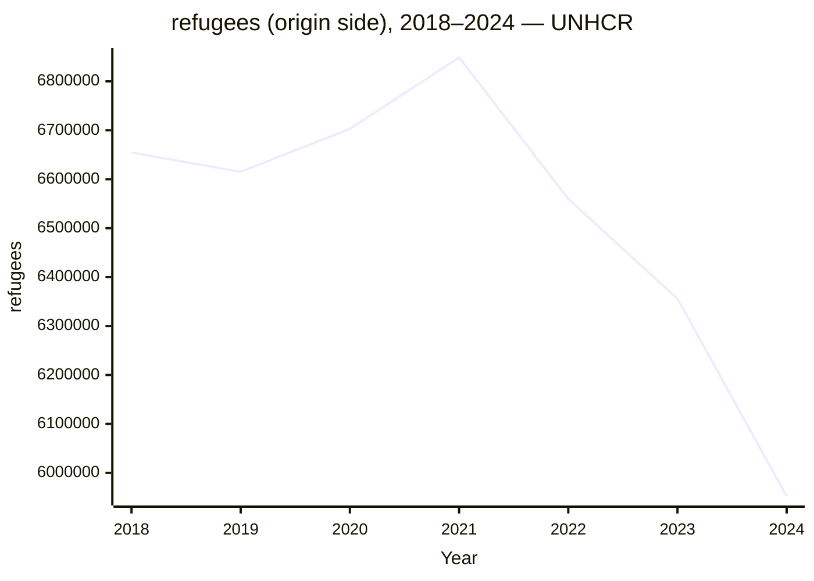

# Example conversations

Real interactions this server enables once connected to an MCP client.
Tool traces show what happens under the hood.

---

## "Compare refugee populations in Egypt and Jordan over the last five years."

**Tool trace**

```
compare_countries({ countries: ["Egypt", "Jordan"], year_from: 2020, year_to: 2024 })
```

**Assistant (excerpt)**

> Between 2020 and 2024 the two countries diverged sharply. Jordan's refugee
> population stayed nearly flat (≈670k → 684k), dominated by Syrians under
> long-term hosting arrangements. Egypt's more than doubled after April 2023
> (≈273k → 2023: 240k registered refugees plus a surge of asylum-seekers),
> driven by arrivals from Sudan…
>
> | Year | Egypt   | Jordan  |
> | ---- | ------- | ------- |
> | 2020 | 273,097 | 669,391 |
> | …    | …       | …       |
>
> _Source: UNHCR Refugee Data Finder (end-year stocks)._

---

## "Generate a humanitarian report about Sudan."

**Tool trace**

```
generate_country_report({ country: "Sudan" })
→ progress: Fetching displacement history … Composing report (5 steps)
```

Returns a complete markdown report — key figures, 10-year refugee trend with
an embedded Mermaid chart, origins of hosted refugees, asylum decisions,
demographics, and method notes — ready to paste into a document. Follow-ups
like _"condense this into a one-page donor briefing"_ work on the structured
output without further tool calls.

---

## "Show demographics of refugees hosted in Egypt."

**Tool trace**

```
demographics({ country: "Egypt" })
```

> As of 2025, UNHCR counts **1,098,306** people of concern in Egypt — 54.2%
> female, 39.1% children (0–17):
>
> | Age group | Female | Male   | Share |
> | --------- | ------ | ------ | ----- |
> | 0–4       | 45,823 | 47,293 | 8.5%  |
> | 5–11      | 87,350 | 90,630 | 16.2% |
> | …         |        |        |       |

---

## "Create a chart of Syrian refugee trends."

**Tool trace**

```
trend_analysis({ country: "Syria", role: "origin" })
generate_chart({ countries: ["Syria"], role: "origin", format: "mermaid" })
```

The `role: "origin"` distinction matters — the model learns it from the tool
descriptions and server instructions: Syrians displaced _from_ Syria, not
refugees hosted _in_ Syria.



Ask for `format: "chartjs"` or `"vega-lite"` for renderable specs, or
`"svg"` for a finished image.

---

## "Which countries host the most refugees right now? Map them."

**Tool trace**

```
top_host_countries({ limit: 10 })
generate_map({ limit: 25 })
```

> The top hosts in 2025: Germany (2.66M), Türkiye (2.39M), Uganda (1.94M),
> Chad (1.50M), Bangladesh (1.18M)… (GeoJSON attached — drop it into
> geojson.io or any Leaflet map.)

---

## "Was there anything unusual in Sudan's displacement data?"

**Tool trace**

```
trend_analysis({ country: "Sudan", role: "origin", year_from: 2010, year_to: 2024 })
```

> Yes — 2023 is a statistical outlier (z ≈ +2.6): people displaced from Sudan
> jumped 78.8% year-over-year, from 837k to 1.50M, coinciding with the
> outbreak of the conflict in April 2023. The regression over 2015–2024 shows
> displacement rising ≈122k/year (R²=0.61), but that average hides the
> post-2023 regime shift…

---

## "Give me the raw numbers as CSV."

**Tool trace**

```
export_data({ dataset: "population", format: "csv", country: "Jordan",
              year_from: 2015, year_to: 2024 })
```

Returns RFC-4180 CSV with normalized headers (`country, country_code, year,
population, refugees, asylum_seekers, …`) — consistent across every provider
this server will ever have.

---

## Using the built-in prompts

In Claude Desktop, pick **donor_briefing** from the prompt menu, type
`Sudan` — the server expands it into instructions that sequence
`generate_country_report` + `demographics`, sets the tone, and requires
citations. No prompt engineering by the user.
